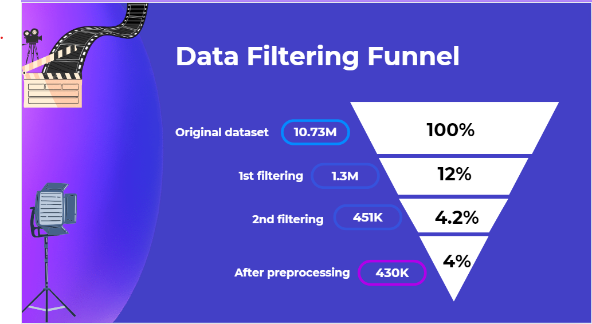
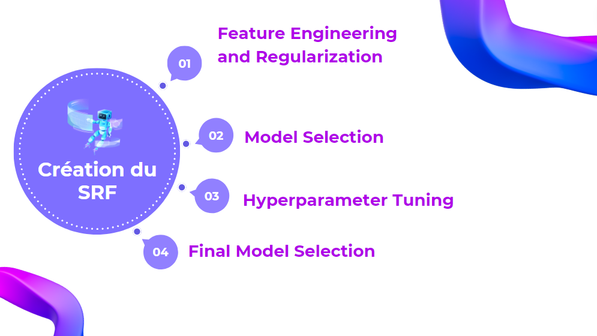
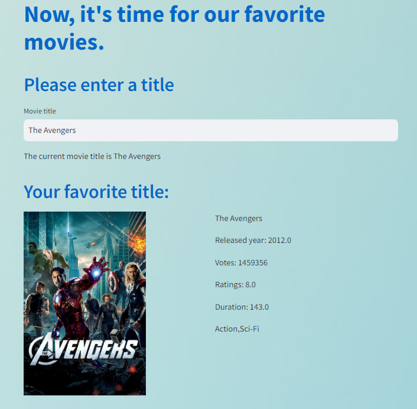
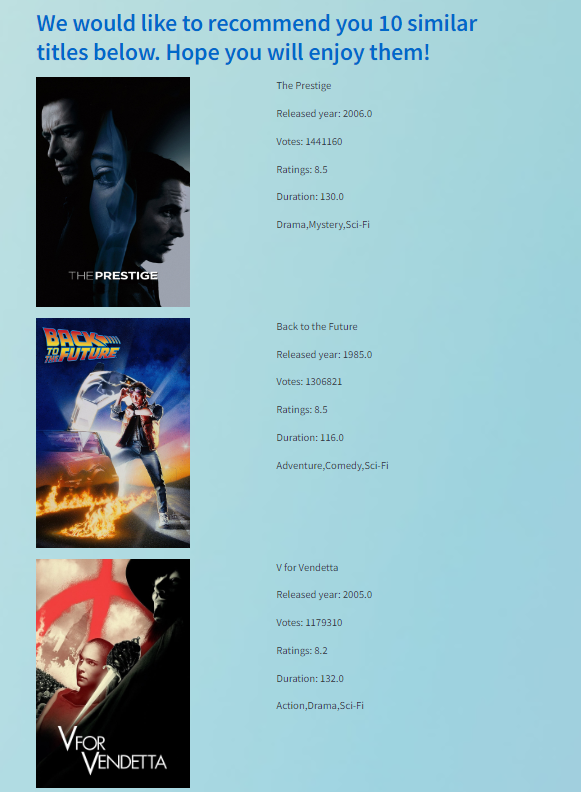
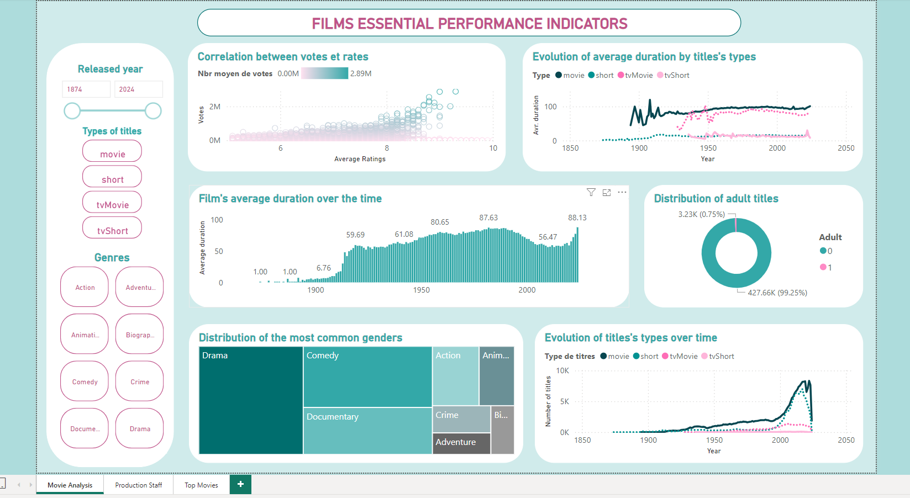
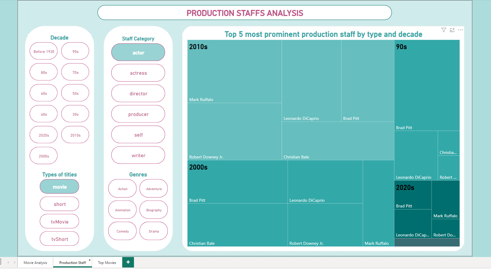
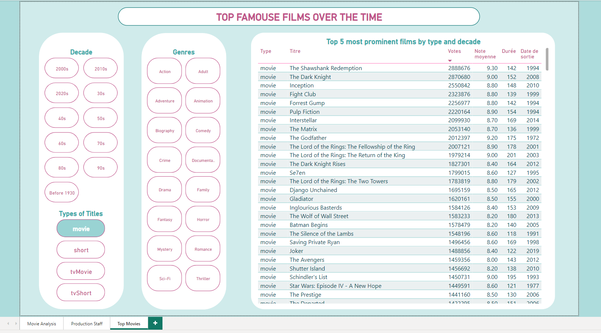

# The Movie Recommendation System
#### Second project implemented in the Intensive Course for Data Analyst at Wild Code School
#### by Halil Ibrahim Celikel and Mai Tran

## Summary of the Project

This is a project I implemented with my classmate Mai Tran at Wild Code School, where i learnt to become a data analyst. Our target is to create the  MRF - Movie Recommendation System which will recommend similar titles to user's given title according to Genres, popularity, Duration, etc. We used the dataset of IMDB - the world's most popular and authoritative source for movie, TV and celebrity content. Find ratings and reviews for the newest movie and TV shows.

We started with 10.73 millions titles that we explored to understand the content of all the given datasets. We filtered to down-size into a dataset of 450k titles. We then clean and remove missing values to get a final one with 430k titles.

About the creation of the recommendation system, we first convert all the text values into numeric values by using LabelEncoder for column 'Type' and method which converted each category of column 'Genres' into a label with binary values.
Since this is a non-supervised model, we passed the step 'model traing' by going directly to the prediction of NearestNeighbors, an unsupervised learner for implementing neighbor searches.
We then tried to change the hyperparameter to get our model better but we dont' see much improvement so we sorted values by setting the weight on Votes and Genres.

## About the dataset:

- All the datasets can be found in the following link:

https://datasets.imdbws.com/

We worked on 7 mass datasets of more than 10 millions titles about movies, tvshow, videos, etc.  Dealing with files that are too large in size, we coud not import all the datasets at the same time, there was no other option than mining 1 or 2 dataset each time.

In addition, according to our client's expectation, we had to create this system for a particular target of users in a sparsely populated place where elderly population occupates almost 60%.

- After completing assigned tasks, our coach wanted to have poster of all recommended movies, so we worked on another dataset of TMDB - another movie site.

## Explaining step by step:
Step 1: Explore and process 8 datasets. 

Step 2: Analyze and reduce the size of main dataset. 

Step 3: Create the MRS - Movie Recommendation Systeme - by doing feature engineering

Step 4: Create Streamlit App for visualization of final product.

## Screenshots of the MRS on Streamlit

***Input favorit movie***

***Recommend 10 similar movies***

## Dashboard of the Project

We created a dashboard of our analysis relatied to the KPIs of the final dataset on PowerBI.. In each page, there is a filter system which provides the interactive functions to all the charts.

The screenshots of the dashboard are as follows:

***1. Basic Indicators***

***2. The Crew Analysis***

***3. The Movies List***

